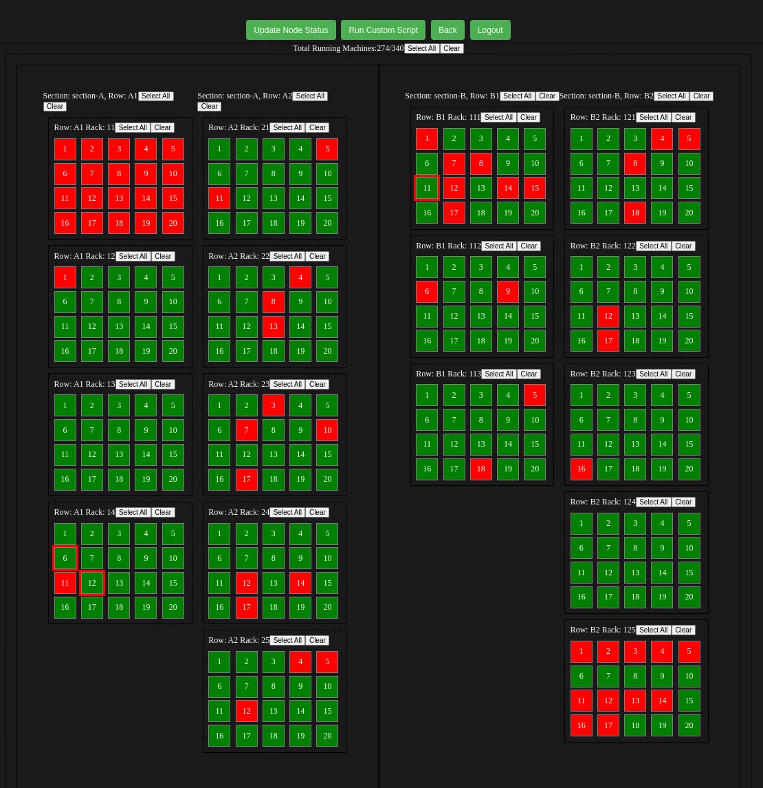
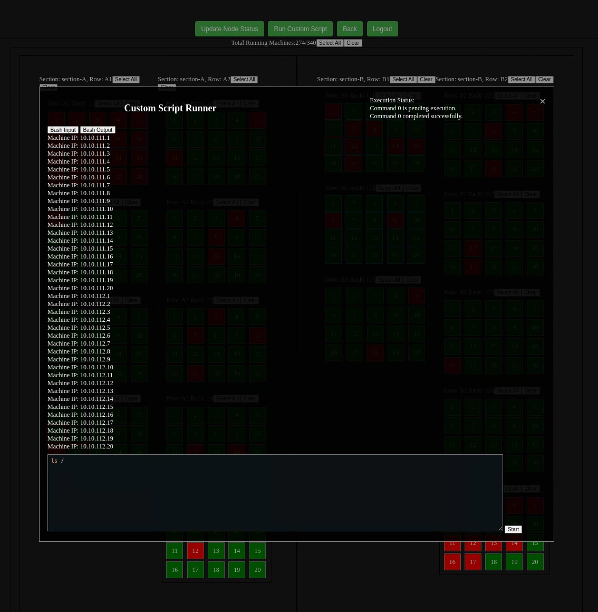
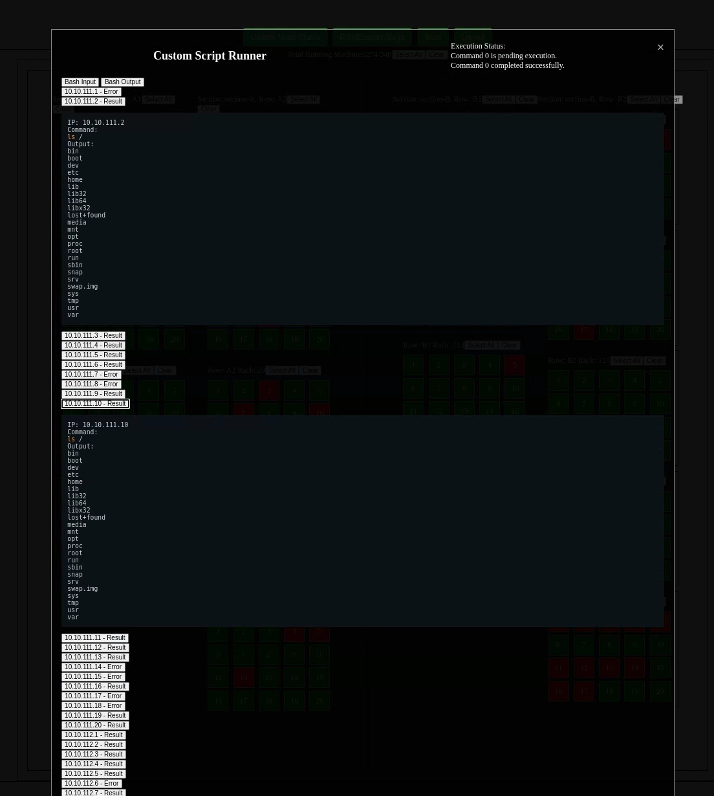

# Nodewatchman

Nodewatchman is a specialized automation and management tool designed for our data center architecture, similar to Ansible but tailored to our specific use case. The project aims to simplify the automation and management of our Linux machines by providing an intuitive UI and a robust set of features.

## Overview

In Nodewatchman, the user interface (UI) represents our data center layout with collections of boxes, racks, and sections. Each machine is associated with a specific rack number, section, and IP address, reflecting the physical layout of our data center.

## Features

- **Visual Layout**: The UI visually represents the physical layout of the data center, allowing easy identification and management of machines based on their physical location.
  
- **Dynamic Selection**: Users can dynamically select any number of machines to run bash scripts. The selected machines are accessed via SSH, and the specified commands are executed on them.
  
- **Output Formatting**: The output from each machine is collected and displayed in a nicely formatted way with syntax highlighting for easy readability.
   
- **Health Check Mechanism**: Each box is color-coded based on its SSH reachability status. Green indicates the machine is reachable via SSH, while red indicates it is not.
- **NIC MAC ID Verification**: A script is included to check the NIC MAC IDs of the machines and compare them to our internal documentation, ensuring the correct machines are in the correct positions in the data center.

## Installation

To install Nodewatchman, follow these steps:

1. Clone the repository:
    ```bash
    git clone https://github.com/yourusername/nodewatchman.git
    cd nodewatchman
    ```

2. Install the necessary dependencies:
    ```bash
    npm install
    ```

3. Configure the project by editing the configuration files as needed:
    - `config.json`: Update with your specific data center configuration.

## Usage

1. Start the Nodewatchman server:
    ```bash
    npm start
    ```

2. Open your web browser and navigate to `http://localhost:3000` to access the Nodewatchman UI.

3. Use the UI to select machines, run scripts, and view the results.

## Running Commands

- To run a bash script on selected machines, select the machines from the UI, enter the bash command, and execute it. The output will be displayed with syntax highlighting.

## Health Check

- The health check mechanism runs periodically to update the color status of each machine based on its SSH reachability:
  - **Green**: Machine is reachable via SSH.
  - **Red**: Machine is not reachable via SSH.

## Contributing

We welcome contributions to improve Nodewatchman. Please fork the repository and submit pull requests.

## License

This project is licensed under the MIT License. See the `LICENSE` file for details.

## Contact

For any inquiries or issues, please contact [yourname@yourdomain.com](mailto:yourname@yourdomain.com).

---

Nodewatchman is developed to enhance the management and automation of our data center, providing a seamless and efficient way to handle our Linux machines.

